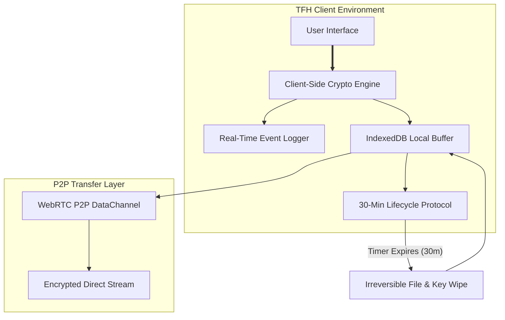

<div align="center">

```text
                                         █████████╗████████╗██╗   ██╗
                                         ╚═══██╔══╝██╔═════╝██║   ██║
                                             ██║   █████╗   ████████║
                                             ██║   ██╔══╝   ██╔═══██║
                                             ██║   ██║      ██║   ██║
                                             ╚═╝   ╚═╝      ╚═╝   ╚═╝
```

### **Temporary File Holder**
**A secure, ephemeral, zero-knowledge utility for temporary browser-based file sharing.**

[](#-license)
[](https://developer.mozilla.org/en-US/docs/Web/API/Web_Crypto_API)
[](https://developer.mozilla.org/en-US/docs/Web/API/IndexedDB_API)
[](https://webrtc.org/)

*Share files securely with an automated 30-minute self-destruction protocol, P2P transfer, and local IndexedDB caching.*

[Live App](https://amithrosky.github.io/TFH/) • [Features](#-key-features) • [Architecture](#-system-architecture) • [Security Model](#-security--privacy-model) • [Quick Start](#-quick-start)

---

</div>

## 📑 Table of Contents
- [Overview](#-overview)
- [Key Features](#-key-features)
- [System Architecture](#-system-architecture)
- [Technical Breakdown](#-technical-breakdown)
- [Security & Privacy Model](#-security--privacy-model)
- [Quick Start](#-quick-start)
- [License](#-license)

---

## 🌐 Overview

**TFH (Temporary File Holder)** is a client-side, privacy-first web utility built for short-term file storage and ephemeral peer-to-peer sharing. Built around a zero-knowledge security philosophy, TFH processes encryption entirely in the browser, buffers payloads in local `IndexedDB` storage, and enforces a strict **30-minute self-destruct protocol** on all hosted assets.

---

## ✨ Key Features

* ⏱️ **30-Minute Self-Destruct Protocol**: Automated lifecycle timer permanently purges stored file blobs, metadata, and memory references after 30 minutes.
* 🔐 **Client-Side Encryption**: Zero-knowledge encryption and decryption pipeline executes locally prior to storage or network transmission.
* ⚡ **Direct P2P File Transfer**: High-speed browser-to-browser streaming via WebRTC DataChannels eliminates reliance on central cloud servers.
* 💾 **IndexedDB Local Buffering**: High-performance local database staging allows fluid handling of large file payloads directly within the browser client.
* 📟 **Real-Time Event System Log**: Integrated telemetry console tracking active handshakes, crypto operations, lifecycle states, and system events in real time.

---

## 🏗️ System Architecture



---

## 🔬 Technical Breakdown

| Component | Technology / Protocol | Purpose |
| :--- | :--- | :--- |
| **Cryptography** | Web Crypto API (AES-GCM / WebCrypto) | End-to-end client-side encryption |
| **Storage Engine** | Browser IndexedDB | High-capacity temporary file staging |
| **Network Protocol** | WebRTC DataChannels | Direct P2P peer transfers |
| **Lifecycle Manager** | Background Timer Agent | Enforces exact 30-minute data purge |
| **Telemetry** | Real-Time Event System Log | Live visibility into operations and transfers |

---

## 🛡️ Security & Privacy Model

* 💥 **Irreversible Data Purge**: Files and crypto references are automatically shredded upon expiration of the 30-minute timer.
* 🔒 **Zero Plaintext Persistence**: File data is encrypted on the client side before being committed to IndexedDB or streamed over P2P.
* 🌐 **Decentralized Pipeline**: Direct peer-to-peer data channels keep file transfers strictly between the sender and receiver.

---

## 🚀 Quick Start

### Access Live Application
You can use TFH directly in your web browser without installation:

👉 **[Launch TFH Web Application](https://amithrosky.github.io/TFH/)**
